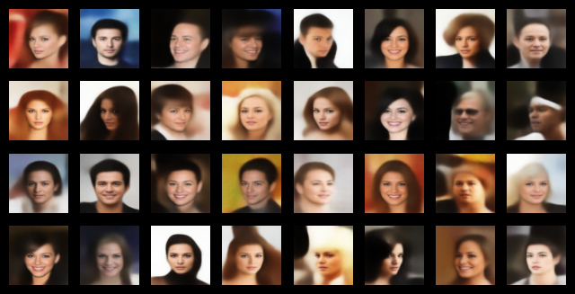
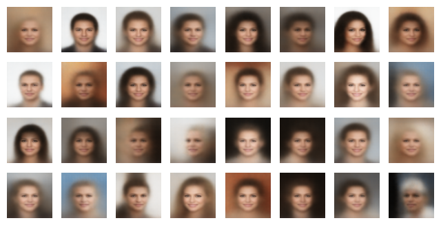

## VisionAlchemy 

Application (MNIST): https://huggingface.co/spaces/xValentim/VisionAlchemyMNIST

Application (CelebA): https://huggingface.co/spaces/xValentim/VisionAlchemyCelebA

(PT) Medium: https://medium.com/@gabriel.valentim.blis/introdu%C3%A7%C3%A3o-cf1b66ca9bfb

## Papers

- [Single Image Deblurring Based on Auxiliary Sobel Loss Function](https://ieeexplore.ieee.org/document/9276836)
- [A Probe Towards Understanding GAN and VAE Models](https://arxiv.org/pdf/1812.05676.pdf)
- [Auto-Encoding Variational Bayes](https://arxiv.org/abs/1312.6114)
- [Deep Residual Learning for Image Recognition](https://arxiv.org/abs/1512.03385)
- [Generative Adversarial Networks](https://arxiv.org/abs/1406.2661)
- [A Privacy-Preserving Walk in the Latent Space of Generative Models for Medical Applications](https://arxiv.org/pdf/2307.02984.pdf) 
- [Denoising Diffusion Probabilistic Models](https://arxiv.org/pdf/2006.11239.pdf)
- [On original and latent space connectivity in deep neural networks](https://arxiv.org/pdf/2311.06816.pdf)
- [Latent Morphologies: Encoding Architectural Features and Decoding Their Structure through Artificial Intelligence](https://dash.harvard.edu/handle/1/37372337)
- [Keras Docs](https://keras.io/api/)
- [DragGan (Web)](https://huggingface.co/spaces/DragGan/DragGan)
- [DragGan](https://arxiv.org/pdf/2305.10973.pdf)

## Introduction

No presente trabalho, vamos explorar a aplicação de modelos generativos para a geração de imagens. A ideia é que, a partir de um conjunto de imagens de treino, o modelo seja capaz de gerar novas imagens que sejam similares às imagens de treino. Em suma, o modelo deve ser capaz de aprender a distribuição de probabilidade das imagens de treino e, a partir disso, gerar novas imagens que sigam essa distribuição. As arquiteturas aqui utilizadas vão se basear em VAEs e GANs, que são dois dos modelos generativos batante populares na literatura. 

Além do contexto básico de geração de imagens, vamos explorar também a aplicação de modelos generativos para gerar imagens interativas. A ideia é que o usuário possa interagir com o modelo de forma a controlar a geração de imagens. Para isso, vamos utilizar a técnica de Latent Walk, que consiste em fazer uma caminhada no espaço latente do modelo para gerar imagens que sejam intermediárias entre duas imagens de referência. A ideia aqui citada, se baseia nos papers [A Privacy-Preserving Walk in the Latent Space of Generative Models for Medical Applications](https://arxiv.org/pdf/2307.02984.pdf) (para entender a ideia de Latent Walk), [DragGan](https://arxiv.org/pdf/2305.10973.pdf) (para entender a aplicação de Latent Walk em imagens interativas), [Single Image Deblurring Based on Auxiliary Sobel Loss Function (Done, Ideia aproveitada para loss extra)](https://ieeexplore.ieee.org/document/9276836) (para entender a ideia de loss extra, aumentando a qualidade do modelo), [Auto-Encoding Variational Bayes (Done)](https://arxiv.org/abs/1312.6114) (para entender a ideia de VAEs com camadas convolucionais) e [Deep Residual Learning for Image Recognition (Done, Ideia aproveitada pra construir um AutorEncoder com arquitetura de Resnet)](https://arxiv.org/abs/1512.03385) (para entender acrescentar a ideia de Resnet na construção do AutoEncoder Convolutional).

## Mudanças na Loss Function

Incorporando as ideias citadas anteriormente, fizemos algumas alterações na loss function do modelo. A ideia é que, além da loss function padrão do modelo, vamos adicionar uma loss extra que vai ajudar a melhorar a qualidade das imagens geradas. A loss extra que vamos adicionar é a loss de Sobel, que é uma técnica de detecção de bordas bastante popular na literatura. A ideia é que, ao adicionar essa loss extra, o modelo seja capaz de gerar imagens com bordas mais definidas e, consequentemente, com mais qualidade. A ideia de adicionar uma loss extra ao modelo foi inspirada no paper [Single Image Deblurring Based on Auxiliary Sobel Loss Function](https://ieeexplore.ieee.org/document/9276836). Por fim, alteramos também a loss de reconstrução para diminuir o blurre das imagens geradas. Acompanhe a equação final que vamos minimizar para treinar o modelo:

$$\mathcal{L} = |I + \delta | I - \psi(\phi(I)) | - \psi(\phi(I))|^{2} -\frac{1}{2} \sum_{i=1}^{N} \left(1 + \log(\sigma_i^2) - \mu_i^2 - \sigma_i^2\right) + \gamma \cdot |f(I) - f(\psi(\phi(I)))|$$

## Modelos

Utilizando a ideia central do paper das VAEs, o nosso modelo vai ser composto por um Encoder e um Decoder. O Encoder vai ser responsável por mapear a imagem de entrada para o espaço latente, enquanto o Decoder vai ser responsável por mapear o vetor latente para a imagem de saída. A ideia é que o Encoder e o Decoder sejam treinados de forma conjunta, de forma que o Encoder aprenda a distribuição de probabilidade das imagens de treino e o Decoder aprenda a gerar imagens a partir do espaço latente. A arquitetura do Encoder e do Decoder vai ser composta por camadas convolucionais, que são bastante populares na literatura. A ideia de utilizar camadas convolucionais foi inspirada no paper [Auto-Encoding Variational Bayes](https://arxiv.org/abs/1312.6114). Além disso, vamos utilizar a ideia de Resnet para construir o Encoder e o Decoder. A ideia de utilizar Resnet foi inspirada no paper [Deep Residual Learning for Image Recognition](https://arxiv.org/abs/1512.03385). A ideia de utilizar Resnet é que ele permite a construção de redes mais profundas sem o problema de vanishing gradient. Por fim, as camadas do Encoder e do Decoder vão ser compostas por camadas convolucionais.

## Espaço latente

Vamos manipular o espaço latente de tal forma que poderemos inserir atributos fake na nossa imagem. A equação que rege essa manipulação é a seguinte:

$$FakeImage = \psi(\phi(x) + \sum_{i} t_i \cdot \vec v_i)$$

Por fim, você pode ver a aplicação web do modelo treinado para o MNIST [aqui](https://huggingface.co/spaces/xValentim/VisionAlchemyMNIST) e para o CelebA [aqui](https://huggingface.co/spaces/xValentim/VisionAlchemyCelebA).

## Resultados de treinamento

Com as mudanças feitas na loss function, conseguimos melhorar a qualidade das imagens geradas. A loss extra de Sobel ajudou a gerar imagens com bordas mais definidas e, consequentemente, com mais qualidade. Além disso, a loss de reconstrução ajudou a diminuir o blurre das imagens geradas. Acompanhe abaixo os resultados de treinamento do modelo:

### Loss Modificada 

### Loss Original

## Datasets

- [MNIST](https://www.tensorflow.org/datasets/catalog/mnist)
- [CelebA](https://www.tensorflow.org/datasets/catalog/celeb_a)